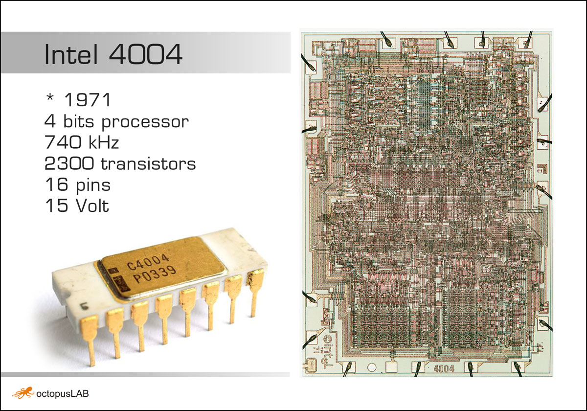

# ESP32 - micropython_4004-emul

simple 4004 emulator - ESP32 & MicroPython (octopus_lab framework)

This repo contains ESP32 Micropython application based on **OctopusLAB Framework** -> [octopusengine/octopuslab](https://github.com/octopusengine/octopuslab).

This runs example, that allows you to control I/O peripherals connected to your [OctopusLAB EDU_KIT1](https://www.octopusengine.org/edu-kit1/).

---

original (python 2.7):
https://github.com/CodeAbbey/intel4004-emu

update (python 3.5) -> micropython

---

https://codeabbey.github.io/heavy-data-1/msc-4-asm-manual-1973.pdf

<pre>
Mnemonic Instruction        MODIFIERS
NOP  No Operation           none
JCN  Jump Conditional       condition, address	
FIM  Fetch Immediate        register pair, data		
SRC  Send Register Control  register pair
FIN  Fetch Indirect         register pair		 
JIN  Jump Indirect          register pair		
JUN  Jump Uncoditional      address	
JMS  Jump to Subroutine     address	
INC  Increment              register		
ISZ  Increment and Skip     register, address
ADD  Add                    register
SUB  Subtract               register
LD   Load                   register
XCH  Exchange               register
BBL  Branch Back and Load   data
LDM  Load Immediate         data
WRM  Write Main Memory	
WMP  Write RAM Port		
WRR  Write ROM Port		
WR0  Write Status Char 0	
WR1  Write Status Char 1	
WR2  Write Status Char 2	
WR3  Write Status Char 3	
SBM  Subtract Main Memory	
RDM  Read Main Memory	
RDR  Read ROM Port		
ADM  Add Main Memory		
RD0  Read Status Char 0	
RD1  Read Status Char 1	
RD2  Read Status Char 2	
RD3  Read Status Char 3	
CLB  Clear Both		
CLC  Clear Carry		
IAC  Increment Accumulator	
CMC  Complement Carry	
CMA  Complement		
RAL  Rotate Left		
RAR  Rotate Right		
TCC  Transfer Carry and Clear	
DAC  Decrement Accumulator	
TCS  Transfer Carry Subtract	
STC  Set Carry	
DAA  Decimal Adjust Accumulator	
KBP  Keybord Process	
DCL  Designate Command Line
</pre>
